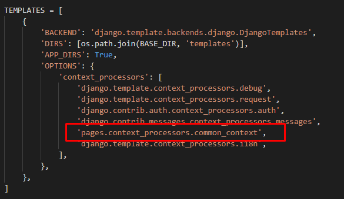

# CONTEXT PROCESSORS

 Umożliwia "dostęp" do funkcji i zmiennych dla wszystkich templatek projektu.

 ## Konfiguracja:

- W ***settings.py*** musimy dodać nowy plik ***context_processors***:

 scieżka to: nazwa aplikacji.nazwa pliku.nazwa funkcji

 

- Tworzymy plik context_processors.py a w nim funkcje które potrzebujemy w projekcie. Nasze zmienne przechowujemy w słowniku. 

  

  Od tego momentu mamy dostęp do zawartości słownika ***main_info*** w każdej templatce projektu (bez konieczności importu) za pomocą tagu, np:
   ```python
   <h1>{{page_name}}</h1>
   ```