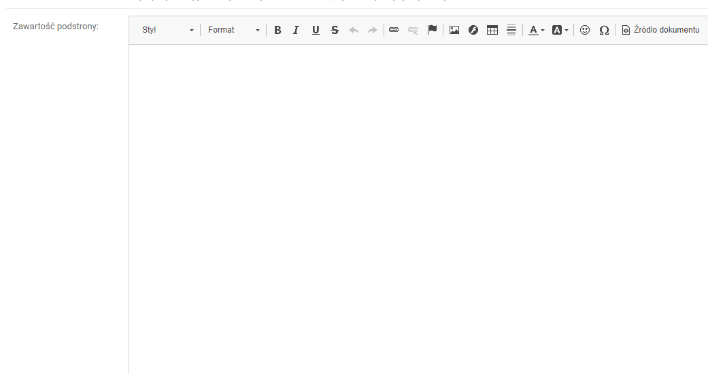

# CKEDITOR

Dodaje do panelu admina WYSIWYG. Dzieki temu możemy bez problemy dodać sformatowaną treść html do konkretnej podstrony. 



### Konfiguracja

W ***settings.py*** dodajemy:

- Do INSTALLED_APPS 
> 'ckeditor',
> 'ckeditor_uploader',


- Ścieżka do folderu przechowującego pliki dodawane za pomocą modułu
>CKEDITOR_UPLOAD_PATH = 'uploads/'

- Jeżeli chcemy aby przesyłane grafiki były optymalizowane ustawiamy wartość na TRUE
>CKEDITOR_FORCE_JPEG_COMPRESSION = True

- Narzędzie używane do optymalizacji przesyłanych plików graficznych. Wspierane jest jedynie Pillow. Dlatego poniższe uznajmy za "must have":
>CKEDITOR_IMAGE_BACKEND = 'pillow'

**UWAGA** Ckeditor działa niezależnie od Optimized Image. 


- Opcjonalne zmiany:

```python
CKEDITOR_CONFIGS = {
    'default':{
        'removePlugins': 'stylesheetparser',
        'allowedContent': True,
        'width': 1500,
        'height':700,
        'entities_latin': False,
    },
}
```
 - Niezbędne jeżeli chcemy dodać klasy, id czy style bezpośrednio w kodzie:
> 'removePlugins': 'stylesheetparser'
>
> 'allowedContent': True

 - Dla polskich znaków:
>'entities_latin': False

 - Rozmiary pola edytora:
>'width': 1500
>'height':700

### Dodanie nowego pola

W **models.py** importujemy:

> from ckeditor_uploader.fields import RichTextUploadingField

Następnie dodajemy nowe pole ckeditora:
> content = RichTextUploadingField()

