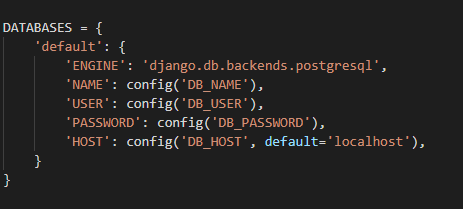
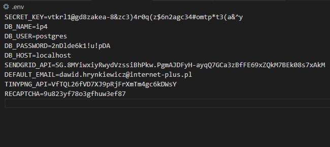

# Decouple

Pozwala na zarządzanie parametrami w ***settings.py*** bez konieczności ponownego wdrożenia gdy zajdzie potrzeba zmian. W przypadku tej aplikacji wykorzystujemy Decouple do przechowywania danych wrażliwych w pliku .env. oraz dodania parametrów domyślnych.

### Konfiguracja

W ***settings.py*** importujemy:

> from decouple import config

### Modyfikacja domyślnych parametrów:

W głównym katalogu aplikacji tworzymy plik .env . W nim przechowywać będziemy wszystkie dane wrażliwe projektu.

- Zamieniamy:
 > SECRET_KEY=vtkrl1@gd8zakea-8&zc3)4r0q(z$6n2agc34#omtp*t3(a&^y
 
 na 
 > SECRET_KEY = config('SECRET_KEY')

 Podstępujemy tak z każdym parametrem który chcemy przenieść do pliku .env. Przykład:

 

 Tutaj dodatkowo ustawiamy dla Hosta wartość domyślną. Jeżeli w pliku .env Django nie znajdzie wartości dla hosta to ustawi dla niego wartość domyślną.

- Plik .env

 

 **UWAGA** Nie dajemy spacji a każdy parametr zaczynamy od nowej linii.