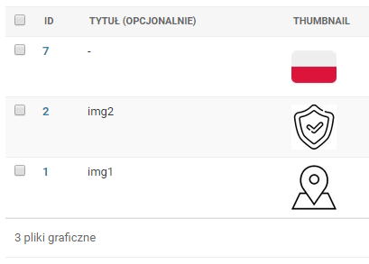

# Image Kit

Pozwala dodać miniaturki do panelu admina.

### Konfiguracja

W ***settings.py*** dodajemy:

- Do INSTALLED_APPS 
> 'imagekit',

### Dodanie miniaturki do modelu:

- Importujemy z modułu:

>from imagekit.models import ImageSpecField
>
>from imagekit.processors import ResizeToFill
>
>from imagekit.admin import AdminThumbnail

- Tworzymy nowe pole:

```python
    img_thumbnail = ImageSpecField(source='img',
                                    processors=[ResizeToFill(50, 50)],
                                    format='JPEG',
                                    options={'quality':90})
```
 gdzie:
 - source - pole z przesyłaną grafiką
 - processors - rozmiary
 - format - format
 - quality - jakość jeżeli zależy Nam na zaoszczędzeniu miejsca
 
Dzieki temu, gdy będziemy dodawać grafikę do Naszej strony image kit automatycznie utworzy dla Nas miniaturkę o podanych parametrach.

- Aby miniaturka była widoczna w panelu admina musimy jeszcze udostepnić ją dla pliku admina. W tym celu przechodzimy do **admin.py**:

 - importujemy
 > from imagekit.admin import AdminThumbnail

 - nastepnie tworzymy klasę Admina dla modelu w którym znajduje się pole miniaturki i dodajemy:

 ```python
 class ImageAdmin(admin.ModelAdmin):
    list_display = ('id', 'title', 'thumbnail_display', 'img', 'display', 'display_order', 'updated', 'created')
    thumbnail_display = AdminThumbnail(image_field='img_thumbnail')
 ```
    ***list_display*** określa które pola chcemy mieć widoczne w panelu admina. Na koniec musimy jeszcze oczywiście zarejestrować modele:
    ```python
    admin.site.register(Image, ImageAdmin)
    ```
- całość wygląda tak:


  panel admina:


