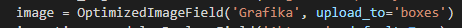

# Optimized Image

Pozwala na optymalizowanie przesyłanych do bazy grafik "w locie". Mamy do wyboru dwie metody optymalizacji:

- domyślne narzędzie dla Django - Pillow
- TinyPNG

Różnice w rozmiarach plików wyjściowych nie są duże ale z korzyścia dla TinyPNG.

**UWAGA** Darmowe API TinyPNG umożliwia optymalizowanie 100 grafik miesięcznie.

### Konfiguracja

W ***settings.py*** dodajemy:

- w INSTALLED_APPS:
> 'optimized_image'

- Jeżeli chcemy aby jakieś rozszerzenie bylo ignorowane przy optymalizacji:
> OPTIMIZED_IMAGE_IGNORE_EXTENSIONS = ['gif']

- Wybieramy metodę optymalizacji - 'tinypng' lub 'pillow'
> OPTIMIZED_IMAGE_METHOD = 'tinypng'

- Klucz API w przypadku wybóru TinyPNG (prechowywany jest w .env) 
> TINYPNG_KEY = config('TINYPNG_API')

### Dodanie nowej grafiki

W ***models.py***:

- Importujemy moduł:
> from optimized_image.fields import OptimizedImageField

- Nastepienie gdy tworzymy pole danego modelu i chcemy korzystać z modułu zamieniamy domyślne:

```python
img = models.ImageField()
```
 na

```python
img = OptimizedImageField()
```
 np:

