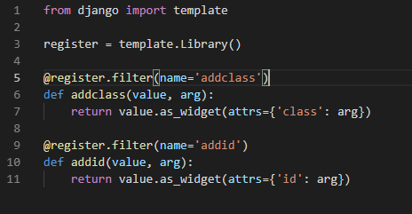

# Filtry

Są to funkcje pythona które możemy użyć bezpośrednio w templatce a dokładniej w tagu obiektu. 

## Tworzenie własnych filtrów

- Tworzymy folder ***templatetags*** a w nim plik z filtrami  ***myfilters.py***:

 ```python
 from django import template

 register = template.Library()

 def addclass(value, arg):
    return value.as_widget(attrs={'class': arg})

 ```

 Powyższy filtr pozowli dodać nową klasę w tagu templatki, np:

 > {{zmienna|addclass:'nazwaklasy'}}

 Jest to przydatne np podczas iteracji, gdzie w prosty sposób możemy numerować elementy strony.

- Aby nowy filtr działał musimy go jeszcze zarejestrować w instacji biblioteki używając zwykłej rejestracji:

 > register.filter('addclass', addlass)

 lub przy pomocy dekoratora:

 >@register.filter(name='addclass')

- Cały plik:

 