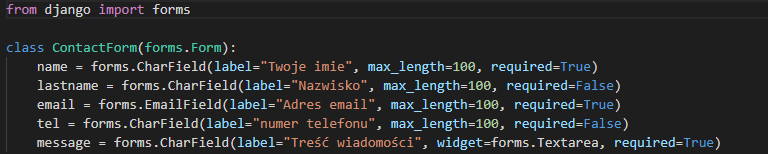

# FORMULARZE

Projekt posiada tylko jeden formularz kontaktowy, znajduje się on w pliku forms.py



W ***views.py*** importujemy formularz a następnie dodaje go w widoku kontaktu:

```python
...

from .forms import ContactForm

...

    if request.method == 'POST':
        form = ContactForm(request.POST)
        if form.is_valid():
            form_name = form.cleaned_data['name']
            form_lastname = form.cleaned_data['lastname']
            form_email = form.cleaned_data['email']
            form_tel = form.cleaned_data['tel']
            form_message = form.cleaned_data['message']

            form_header = f'Otrzymałeś wiadomość od {form_name} {form_lastname}'
            formatted_message = (
                f'Treść wiadomości:\n {form_message} \n '
                f'\n Dane adresata:\n'
                f'\n Imię i Nazwysko {form_name} {form_lastname}\n'
                f'telefon: {form_tel} \n'
                f'email: {form_email}'
            )

            send_mail(form_header,  formatted_message, 
                        form_email, [settings.DEFAULT_EMAIL_ADRESS],
                        fail_silently=False)
    form = ContactForm

```

- Treść wiadomości formatujemy za pomocą ***f-string***
- Wysyłanie odbywa się za pośrednictwem Sendgrid'a a dokładniej dodanego do projektu: ***django-sendgrid***
- Formularz jest zabezpieczony ***reCaptcha v3***