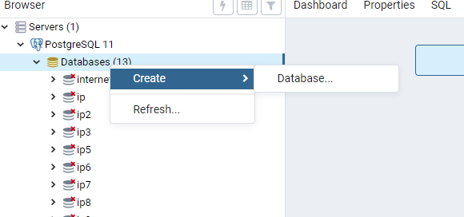
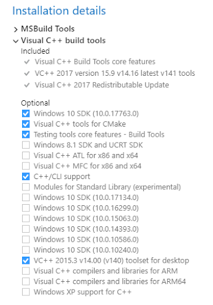
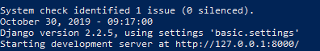

# Konfiguracja

Zarówno tworząc nowy projekt w Django jak i kopiując gotowy musimy przejść kilka kroków w celu uruchomienia aplikacji. 

1. Pobieramy Pythona w wersji 3.7.1:
 https://www.python.org/downloads/release/python-371/

 - Pamiętaj aby w pierszym kroku zaznaczyć checkboxa 'Dodaj pythona do path'. Jeżeli mimo to wystepuje problem możliwe, że trzeba dodać ręcznie ściezkę w zmiennych środowiskowych systemu (Windows)
 - Jeżeli korzystasz z VS Code zainstaluj paczkę Pythona. Inaczej ***pip*** nie będzie działał w terminalu.

2. Pobieramy projekt z Gitlaba:
 > git clone https://gitlab.com/frontend-ip/basic-cms.git

3. Instalujemy PostgreSQL oraz pgAdmin:
 - pobieramy i instalujemy https://www.postgresql.org/download/ :
    - przy instalacji tworzymy hasło którym później będziemy się logować do pgAdmin 
    - hasło dodajemy także do pliku ***.env***
 - potrzebujemy także narzędzia do zarządzania bazą:
    - instalujemy https://www.pgadmin.org/download/pgadmin-4-windows/
  - po instalacji uruchamiamy pgAdmina i tworzymy nową bazę:

     

    - klikamy prawym na ***Databases*** i dalej create -> databases -> podajemy tylko nazwę Naszej basy i klikamy ***save***
    - nazwę bazy oraz usera(owner) dodajemy do pliku ***.env***
 

4. Zmieniamy nazwę pliku ***.env.example*** zostawiając samo ***.env***. W nim podajemy swoje dane do bazy danych utworzonej powyżej, pozostałe pola mogą mieć randomowe ciągi znaków - ważne, żeby nie było żadnych spacji! 

5. Projekt (jak i samo Django) jest ustawiony na pracę z PostgreSQL. Jeżeli chcesz korzystać z innej bazy potrzeba:
 - zmienić silnik w ustawieniach projektu
 > basic -> settings -> development
    'ENGINE': 'django.db.backends.postgresql',

    zamieniamy postresql na myslq | sqlite3 | mariadb
    więcej info tutaj: https://docs.djangoproject.com/en/3.0/ref/databases/
 - doinstalować potrzebne zależności:

    w terminalu przy próbie migracji dostaniesz error i informację jakich paczek brakuje, 
    wystarczy je zainstalować za pomocą:
        > pip install nazwapaczki

6. Instalujemy zależności które znajdują się w pliku ***requirements.txt***:
 > pip install -r requirements.txt 

 - możliwe, że wystąpią błędy:
    - problem kompatybilności modułu mixin: nic nie robimy, wszytko będzie działać poprawnie
    - problem z Ckeditor: musimy odinstalować i jeszcze raz zainstalować ten moduł:
        > pip uninstall django-ckeditor
        >
        > pip install django-ckeditor

    - problem z Visual C++: należy doinstalować brakujące komponenty: 
        https://stackoverflow.com/questions/29846087/microsoft-visual-c-14-0-is-required-unable-to-find-vcvarsall-bat

        to co potrzebujemy po pobraniu instalatora:

        

### Dalej konfigurujemy już samo uruchomienie projektu. Są na to 2 sposoby:

##### 1. Ręcznie:

Znajdujemy w terminalu główny folder z aplikacją i wpisujemy:

> python manage.py makemigrations

Tworzy w aplikacji tabele modeli

> python manage.py migrate

Migruje tabele do bazy danych

> python manage.py createsuperuser

Podajemy odpowiednie dane - są to dane którymi będziemy się logować do panelu admina(można tworzyć dowolną liczę superuserów). 

> python manage.py collectstatic 

Niezbędne w celu mapowania plików jeżeli projekt nie zawiera folderów 'media' i 'static' co jest raczej domyślną opcją - nowe projekty nie potrzebują starych plików z grafikami czy customowym css'em. Jeżeli operacja zakończy się niepowodzeniem prawdopodobnie musimy dodać w ***settings.py*** ścieżki dla głównych folderów:

```python
STATIC_URL = '/static/'
STATIC_ROOT = os.path.join(BASE_DIR, 'static')

MEDIA_URL = '/media/'
MEDIA_ROOT = os.path.join(BASE_DIR, 'media')
```

Nastepnie odpalamy Nasz lokalny serwer:
> python manage.py runserver


##### 2. Automatycznie, dzieki napisanej w tym celu jednej komendy dla całego procesu:

> python manage.py localdeploy

**UWAGA** - jeżeli komenda wyświetli błąd dla któregoś z procesów sugeruję skorzystać z opcji "ręcznej" w celu zdiagnozowania gdzie dokładnie wystepuje problem.

**UWAGA 2** - jeżeli wszystko przebiegło poprawnie a mimo to terminal kolejny raz prosi o podanie danych po prostu go zamknij (wszystko działa już poprawnie i nie ma potrzeby dodawać kolejnego usera)

### Uruchomienie projektu:

> python manage.py runserver

Jeżeli zobaczymy poniższy komunikat wszystko działa poprawnie. Wpisujemy w przeglądarce podany adres i wyświetli się Nasz projekt.



stronę znajdziesz pod adresem: ***http://127.0.0.1:8000/***

a panel admina ***http://127.0.0.1:8000/admin/***

***UWAGA*** W celu poprawnego ładowania Projektów należy utworzyć swój nowy projekt a następnie usunąć domyślny ***default_project_1***. Jeżeli tego nie zrobimy może wystąpić problem z aktywacją Naszego projektu!