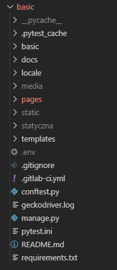
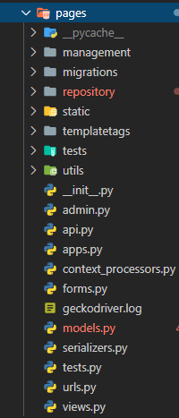

# Struktura aplikacji

Projekty w Django budowane są przez tworzenie projektu a nastepnie dodawanie "apps" czyli aplikacji. Przy wiekszym projekcie warto go dzielić ale w tym przypadku nie jest to konieczne. Dlatego projekt (basic) posiada tylko jedną apkę - pages. 

### Główna

**basic** - root projektu

**docs** - dokumentacja całego projektu

**locale** - pliki językowe (do wersji wielojęzykowej)

**media** - wszystkie pliki graficzne, które dodajemy poprzez panel admina

**pages** - główna aplikacja strony

**static** - statyczne pliki projektu (grafiki, style, skrypty)

**statyczna** - pojawi się, jeżeli wygenerujemy statyczną wersję projektu

**templates** - wszystkie szablony podstron

**.env** - przechowuje wrażliwe dane (klucze API, dane dostepowe do bazy danych)

**.gitignore** - określa, które pliki maja być pominięte przy wysyłaniu projektu do repozytorium

**.gitlab-ci.yml** - ustawienia dokumentacji dla poprawnego wyświetlania w repozytorium

**conftest.py** - globalne ustawienia dla testów jednostkowych

**geckodriver.log** - logi selenium

**pytest.ini** - inicjalizuje pytesta w projekcie

**requirements** - wszystkie zależności niezbędne do poprawnego działania projektu

### Pages

**management/** - własne komendy które zautomatyzują Nam pracę z Shellem/Bashem

**migrations/** - wszystkie pliki związane z bazą danych (tworzą się po wywołaniu komendy migracji)

**repository/** - wzorzec projektowy (Singleton) który zarządza modelem Projekt

**static/** - pliki statyczne

**templatetags/** - własne filtry wykrzystywane w templatkach

**tests/** - testy projektu

**utils/** - własne skrypty pythona

**context_processors.py** - umożliwia "dostęp" do funkcji i zmiennych dla wszsytkich templatek projektu

**serializers.py** - serializacja danych niezbędna do utworzenia REST API