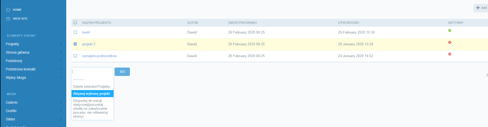
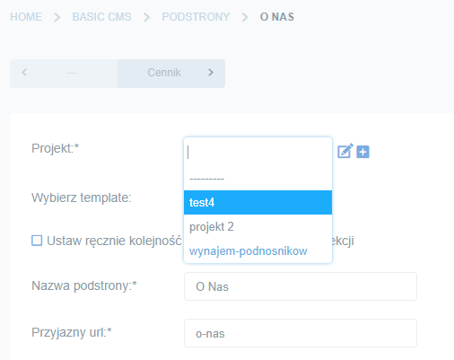
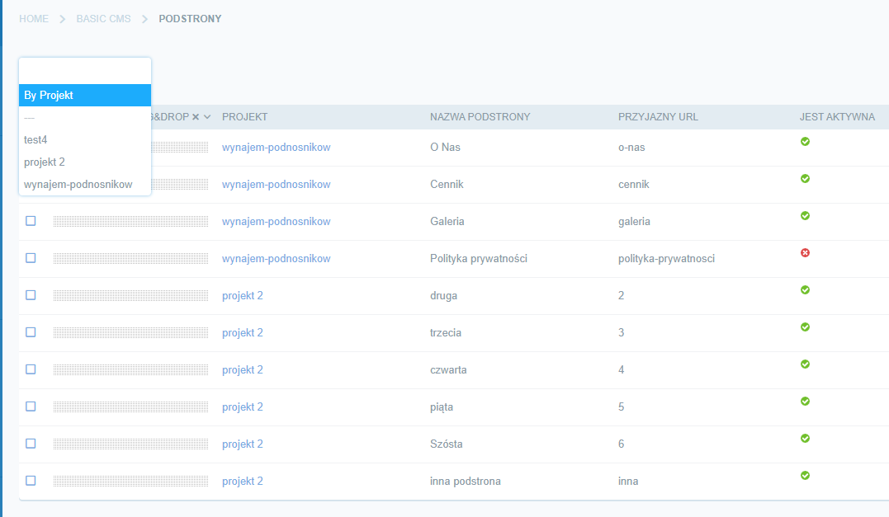

# Projekty

1. Projekty pozwalają budować a potem przechowywać wiele stron klientów jednocześnie. Zaczynając budowę nowej strony tworzymy nowy projekt a następnie go aktywujemy (tylko aktywny projekt będzie wyświetlał się w przeglądarce):

2. Aktywacja nie jest niezbędna do budowy strony ponieważ dodając kolejne elementy (podstrony, galerie itd) zawsze wybieramy projekt z którym dany obiekt ma być powiązany:

3. Na pierwszej grafice mamy także drugą, ważną opcję czyli **eksport projetu do wersji statycznej**. Wcześniej była potrzeba pisania komendy w terminalu. Teraz zostało to dodane do menu i po wybraniu projektu oraz kliknięciu ***GO*** zacznie się generowanie strony. Znajdziemy ją w głównym katalogu projektu w folderze ***statyczna***.

4. Wszystkie obiekty możemy filtrować na podstawie projektu (przydatne gdy podstron czy grafik przybędzie):

