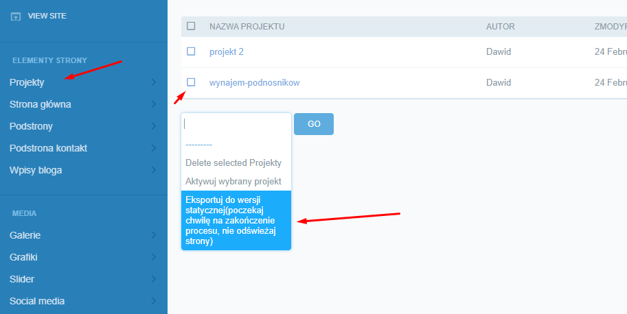
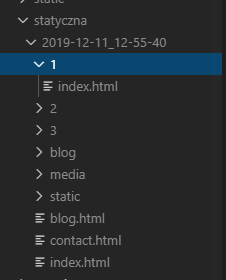

# STATYCZNA WERSJA

W celu umożliwienia wdrożenia strony na serwery nie wspierające Django została dodana możliwość wygenerowania statycznej wersji strony. 


Domyślnie generowanie statyczne obejmie wszystkie foldery i pliki w folderze ***static*** . Aby tego uniknąć należy bezpośrednio w module dodać 'zbędne' foldery do ignorowanych:

wchodzimy w moduł:

**Python -> Lib -> site-packages -> django_distill -> renderer.py**

nastepnie dodajemy do krotki ```_ignore_dirs``` foldery wykuczone przez generator:

  ``` _ignore_dirs = ('admin', 'ckeditor', 'jet', 'jet.dashboard', 'range_filter', 'grappelli')```

## Generowanie plików

 1. Poprzez panel:

   

 2. Za pomocą terminala:
   - W wierszu poleceń szukamy Naszego projektu, w moim przypadku jest to ścieżka:
    > cd .\Desktop\basic\basic\
   - Generujemy statyczną wersję strony:

     > python manage.py generate_static_website


 3. Strona została wygenerowana i znajduje się w nowo utworzonym folderze ***statyczna***. Każde wywołanie generatora utworzy nowy folder z dokładną datą. Dzieki temu mamy pewnego rodzaju
    backup'y strony i nie nadpisujemy ciągle tej samej wersji.

     

     ***UWAGA*** Podstrony oraz wpisy blogowe znajdują się w oddzielnych folderach nazwanych tak samo. Wszystkie pliki generują się jako ***index.html***. Ponieważ są stronami podrzędnymi to posiadają unikalny ***slug***. Dzieki temu scieżka treść jest generowana poprawnie. 

 4. Jeżeli wszystko przebiegło poprawnie dostaniemy komunikat:

   ``` ************* Command has been execute without any error*************```

 5. Kopiujemy wszystkie pliki, wrzucamy na serwer i gotowe!

 


