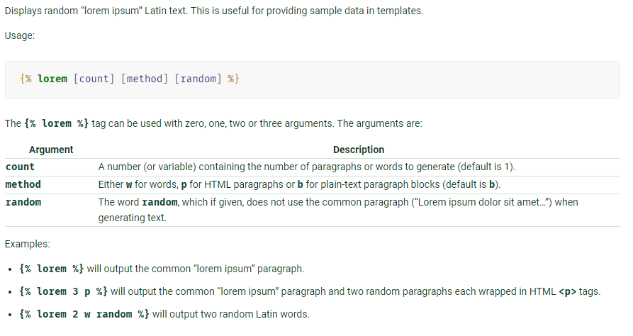

## Tworzenie nowej templatki

Tworzymy odpowiedni folder i pliki zgodnie z konwencją. Dalej kopiujemy kod z gotowej templatki i modyfikujemy wg swojegu uznania pamiętając o zachowaniu
tagów templatki w niezmienionej formie. 

**UWAGA** Jeżeli tworzymy nowe foldery/pliki ze stylami musimy pamiętać o wykonaniu w konsoli (będąc w głownym folderze projektu):
 > python manage.py collectstatic

 inaczej Django nie "znajdzie" nowych plików.

- Sortowanie 

 Jeżeli chcemy sortować poszczególne sekcje ręcznie to pierwszym etapem jest zaznaczenie checkboxa w panelu admina 

 
 
 Za sortowanie odpowiada warunek z dodatkową klasą ***wrapper***:
 ```python

 <div class="wrapper col s6">

 ```

 Nastepnie każda z głównych sekcji posiada atrybut ***data-sort*** którego wartość pobierana jest z bazy:

 ```python

 <div class="section_one" data-sort="{{homepage.display_gallery_order}}">

 ```

 Sekcje sortowane są funkcją JavaScript. Możemy ją wykorzystać do sortowania innych modeli (a dokładniej do sortowania pól konkretnego modelu). Nie powinnismy tego stosować przy sortowaniu obiektów(od tego jest ORM):

 ```javascript

     jQuery.fn.sortDivs = function sortDivs(tag) {
      $(tag, this[0]).sort(dec_sort).appendTo(this[0]);
      function dec_sort(a, b){ return ($(b).data("sort")) < ($(a).data("sort")) ? 1 : -1; }
  };
      $('.wrapper').sortDivs("> div");

 ```


- Dodanie lorem ipsum

 Django posiada wbudowany filtr który pozwala na szybkie lotrem, z dokumentacji: 
    
 

- W folderze ***templates/szablony*** dodane są pomocne pliki z komentarzami opisującymi poszczególne fragmenty kodu.