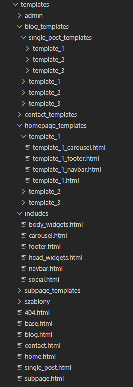
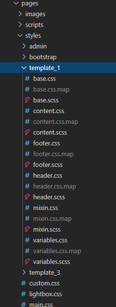
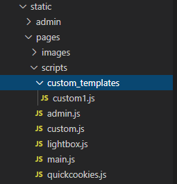

# Templatki

## Struktura:

 - Osobne foldery dla strony głównej, podstron, bloga, pojedyńczego wpisy bloga, kontaktu

 

 - Każda templatka ma swój folder z plikami html, stylami oraz JS'em.

  

  

   Jeżeli dodajemy własne skrypty do konkretnej templatki to nazywamy plik "custom1.js" dla templatki 1, "custom2.js" dla templatki 2 itd.

    ***UWAGA*** W stylach głownym plikiem musi być base.scss, pozostałe nazwy wg upodobania.
 
 - Header i footer bloga oraz podstrony kontakt includują się z wybranej templatki

    **UWAGA** - Jeżeli w panelu admina nie wybierzemy żadnej gotowej templatki załadowane zostaną pliki domyślne: 
    home.html | subpage.html | contact.html | blog.html | single_blog.html oraz ***main.css*** i pliki z folderu ***includes***

